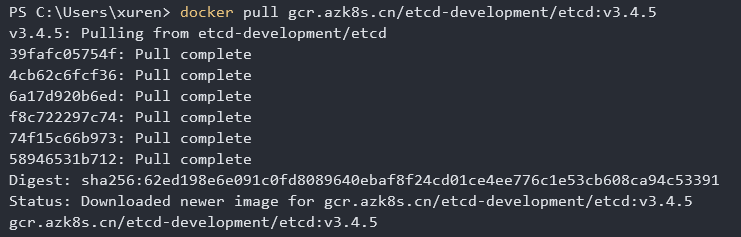
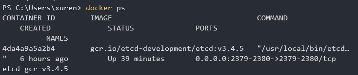

# etcd 

使用etcd保证master和work node上的所有键值对保持一致，etcd使用raft算法，比较简单。

国内安装，无GFW忽略，目前选用docker安装，其他安装方式较为简单可以参考如下链接：

> [https://github.com/etcd-io/etcd/releases](https://github.com/etcd-io/etcd/releases)

## docker registry

如上面链接所示，etcd的安装方法为：

```bash
rm -rf /tmp/etcd-data.tmp && mkdir -p /tmp/etcd-data.tmp && \
  docker rmi gcr.io/etcd-development/etcd:v3.4.5 || true && \
  docker run \
  -p 2379:2379 \
  -p 2380:2380 \
  --mount type=bind,source=/tmp/etcd-data.tmp,destination=/etcd-data \
  --name etcd-gcr-v3.4.5 \
  gcr.io/etcd-development/etcd:v3.4.5 \
  /usr/local/bin/etcd \
  --name s1 \
  --data-dir /etcd-data \
  --listen-client-urls http://0.0.0.0:2379 \
  --advertise-client-urls http://0.0.0.0:2379 \
  --listen-peer-urls http://0.0.0.0:2380 \
  --initial-advertise-peer-urls http://0.0.0.0:2380 \
  --initial-cluster s1=http://0.0.0.0:2380 \
  --initial-cluster-token tkn \
  --initial-cluster-state new \
  --log-level info \
  --logger zap \
  --log-outputs stderr

docker exec etcd-gcr-v3.4.5 /bin/sh -c "/usr/local/bin/etcd --version"
docker exec etcd-gcr-v3.4.5 /bin/sh -c "/usr/local/bin/etcdctl version"
docker exec etcd-gcr-v3.4.5 /bin/sh -c "/usr/local/bin/etcdctl endpoint health"
docker exec etcd-gcr-v3.4.5 /bin/sh -c "/usr/local/bin/etcdctl put foo bar"
docker exec etcd-gcr-v3.4.5 /bin/sh -c "/usr/local/bin/etcdctl get foo"
```

在上面的代码中，比较遗憾的是国内没有办法访问 gcr.io/etcd-development/etcd:v3.4.5 地址，所以可以使用azure的mirror或者阿里云的mirror

所以执行步骤如下（因为我使用的windows平台，所以以windows为例）：

```bash
docker pull gcr.azk8s.cn/etcd-development/etcd:v3.4.5
```



rename 你的 image

```bash
 docker tag gcr.azk8s.cn/etcd-development/etcd:v3.4.5 gcr.io/etcd-development/etcd:v3.4.5
```

这样执行起来就比较方便

```bash
docker run -d -p 2379:2379  -p 2380:2380  --name etcd-gcr-v3.4.5  gcr.io/etcd-development/etcd:v3.4.5 /usr/local/bin/etcd  --name s1  --data-dir /etcd-data  --listen-client-urls http://0.0.0.0:2379  --advertise-client-urls http://0.0.0.0:2379  --listen-peer-urls http://0.0.0.0:2380  --initial-advertise-peer-urls http://0.0.0.0:2380  --initial-cluster s1=http://0.0.0.0:2380  --initial-cluster-token tkn  --initial-cluster-state new --log-level info --logger zap --log-outputs stderr
```

使用命令行来执行，最后得到正在运行的container




