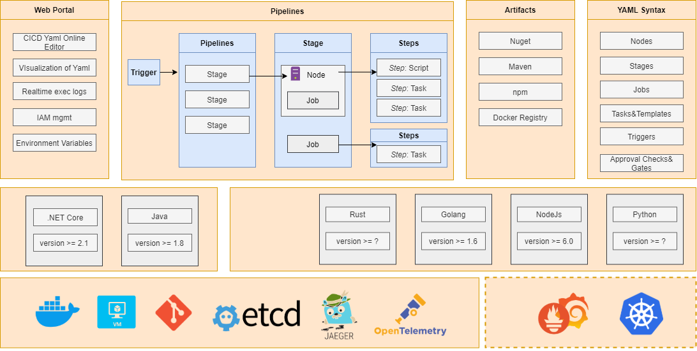
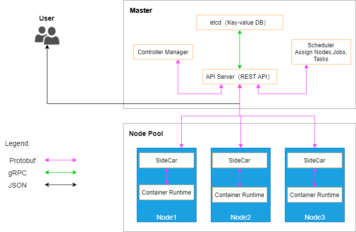

# Overview

## 起因

CICD的工具很多，Gitlab原生支持了gitlab-ci.yml，并且可以对接Kubernetes，Github Actions出了支持基本功能之外，还支持了对接各个云平台的插件，做的非常好，但是对于我们普通的开发者来说，因为防火墙的关系，很难真的完全享受带来的便利，又由于各种收费政策，所以准备自己开发一个DevOps平台

为什么不用Jenkins？

jenkins非常好，有很多的插件，使用的人也非常多，对于已经使用或者计划使用的开发同学来说完全没有问题，但它的缺点也显而易见，对于容器的支持非常不好，如果你还在想支持一门新的语言就要写一个plugin的方式的话，那jenkins也适合你，对于一个普通的开发来说，我希望能够有一个完全免费的平台，能够给予容器化进行CICD，甚至Agile的全生命周期的管理，所以就有了这个平台的想法

## 目的

使用CCID工具，希望能够达到如下效果：

* 简单 简单 简单
* 快速部署，快速更新
* 组件的实时监控
* 全语言平台的支持
* 多个Package工具包的管理

## 路线图

CCID目前还处在快速迭代阶段，甚至还在设想阶段，但是秉持着人人为我我为人人的观点，此平台会完全开源，也希望每个开发同学能够pull request，贡献自己的一份力量

## 架构设计

CCID以全开源组件为基础，基于Golang语言开发，如下为架构设计图

##　MVP

在MVP中，我们会以基本功能为主，如下列出了MVP功能中的基础

### Features

* YAML 定义和支持
  * 基本语法支持
  * 基础组建支持，包括Nodes、Stages、Jobs、Tasks、Trigger
* Artifacts 支持
  * Nuget 支持
  * Maven 支持
  * Docker Registry 支持
  * Direct Link 支持
* Pipelines 支持
  * CI
  * CD
  * Nodes
* Portal (不支持)
* ...

## Component

MVP的组件设计非常类似于Kubernetes的设计，因为在最初设想的时候发现有很多相同的地方，于是站在了前人的肩膀上进行开发

Master：CCID的控制核心，四个组件管理CCID平台

* etcd ：给予raft算法的分布式一致性组件
* Scheduler：分配节点、工作、任务的任务调度平台
* Controller Manager：检查每个组件状态的平台，管理所有的Node和Node上的组件
* API Server：给予REST API的接口平台

Node Pool：所有工作节点的集合，每一台叫做一个Work Node，每天Work Node上有两个组件

* SideCar：提供对接Master和Work Node的桥梁，管理、监控每台Work Node，分配任务等
* Container Runtime：提供基于Docker的编译的生命周期管理

## 开发计划

闲散人员，暂无计划

